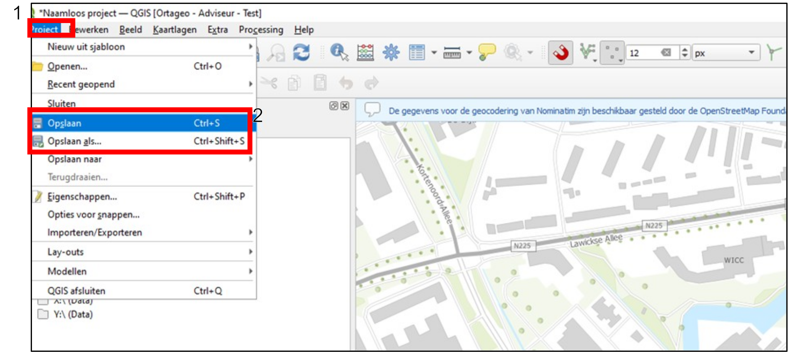

---

title: "1.6 Opslaan project"

date: 2025-11-07

draft: false

weight: 60

---

In deze stap wordt er vanuit gegaan dat er al een QGIS project geopend is welke nu opgeslagen dient te worden. Het opslaan van individuele datalagen wordt hier niet behandeld (zie hiervoor 3 Kaartlagen).

<ol style="margin-left: 1em;">
<li>In Figuur 1.6 wordt links bovenin op “project’ geklikt (blok ‘1’ in Figuur 1.3), er opent nu een dropdown menu.</li>
<li>In het dropdown menu zijn de vierde en de vijfde optie respectievelijk ‘opslaan’ en ‘opslaan als’.</li>
<li>Bij ‘opslaan’ wordt het project opgeslagen onder de huidige naam, indien het project nog niet eerder was opgeslagen opent zich een popupscherm met de verkenner. Je moet nu de locatie kiezen waar het project opgeslagen moet worden.</li>
<li>Bij ‘opslaan als’ kun je het project opslaan onder een nieuwe naam, er opent zich dan een popupscherm waarbij je de locatie voor het project moet gaan selecteren en een naam voor het nieuwe project moet opgeven.</li>
<li>Het project is nu opgeslagen.</li>
</ol>

Figuur 1.6

