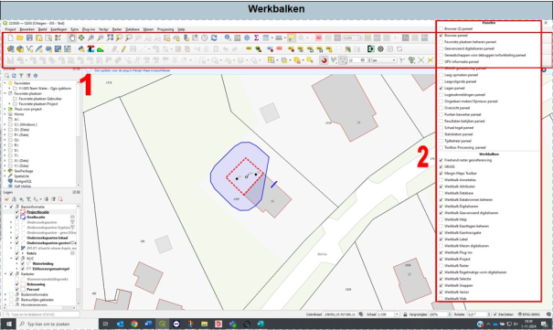

---

title: "1.8 Werkbalk"

date: 2025-11-07

draft: false 

weight: 80      

---

In de balk boven in je scherm heb je verschillende functies (1. In Figuur 1.8). In het gebruikersprofiel (1.7 Gebruikersprofielen) ‘adviseur’ is deze balk flink uitgekleed. In het gebruiksprofiel ‘GIS’ zijn veel functies beschikbaar. Indien je dit zelf wilt inrichten, dan kan dit op de volgende manier.

Figuur 1.8

1. Klik in de balk op rechtermuisknop. Er verschijnt een pop-upscherm.
2. In het pop-upscherm kan je kiezen welke functies je zichtbaar wilt hebben in je werkbalk en welke niet.

