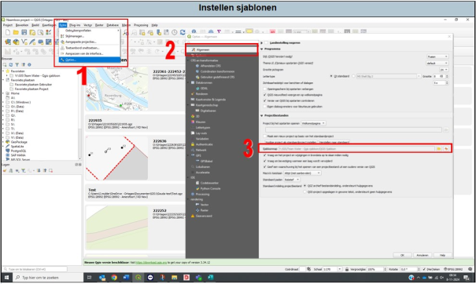

Bij nieuwe gebruikers zijn de sjablonen nog niet beschikbaar. Dit zal ingesteld moeten worden. Dit gaat als volgt (zie ook Figuur 1):
1.	Ga naar ‘extra’ en druk vervolgens op opties.
2.	Er verschijnt een pop-upscherm. Ga naar ‘algemeen’.
3.	Ga naar sjabloonmap en druk op het icoontje voor ‘bladeren’.
4.	Ga naar de Y-schijf (Software), dan naar de map ‘GIS’, dan naar de map ‘Team Water – Qgis sjabloon’ en selecteer vervolgens de map ‘Qgis Sjabloon’. Druk op ‘OK’ en start Qgis opnieuw op.

Figuur 1.