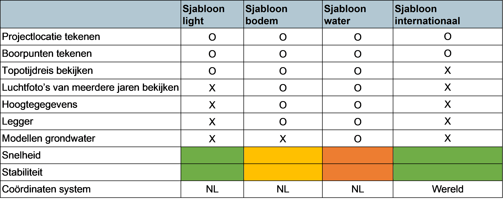

Binnen Ortageo zijn er vier projectsjablonen die gebruikt kunnen worden.

1.	Sjabloon light
2.	Sjabloon bodem
3.	Sjabloon water
4.	Sjabloon internationaal

Sjabloon light is de lichtste versie van de Ortageo sjablonen en opent daarom ook het snelste. Met de light sjabloon kan je de projectlocatie, boorpunten intekenen en Topotijdreis bekijken. Dit zou genoeg moeten zijn om een simpel boorplan te tekenen.

Sjabloon bodem is de medium versie van de Ortageo sjablonen en opent daarom ook ietwat langzamer dan de light sjabloon. Je krijgt met de sjabloon hetzelfde als met de light sjabloon, maar krijgt nog meer informatie te zien. Zo kan je ook luchtfoto’s van de afgelopen 10 à 20 jaar zien, hoogtegegevens bekijken en informatie van de legger inzien. Het nadeel ten opzichte van de light sjabloon is dat QGIS er nog wel eens wat extra tijd over doet om gegevens in te laden, omdat deze meer gebruik maakt van data van externe servers. Als deze servers problemen hebben, dan heeft QGIS wat meer moeite met inladen.

Sjabloon water is de zwaarste versie van de Ortageo sjablonen en is daarmee ook de traagste met openen. Met deze volledige versie kan je doen wat je met sjabloon bodem kan, maar je kan ook meerdere grondwatermodellen bekijken. Omdat dit sjabloon de meeste externe data gebruiken, is dit sjabloon ook de meest instabiele, waardoor de wachttijd bij het opstarten extra lang kan duren.

Sjabloon internationaal is een sjabloon die speciaal is gemaakt voor de projecten in het buitenland. Deze maakt dan ook gebruik van een ander coördinaten stelsel dan de andere sjablonen. Het enige wat je hiermee kan doen is de onderzoekslocatie intekenen en boorpunten plaatsen.

In de tabel hieronder zijn de verschillen tussen de drie basissjablonen samengevat. Misschien dat deze je kan helpen bij het uitkiezen van de meest passende sjabloon bij jouw project.

